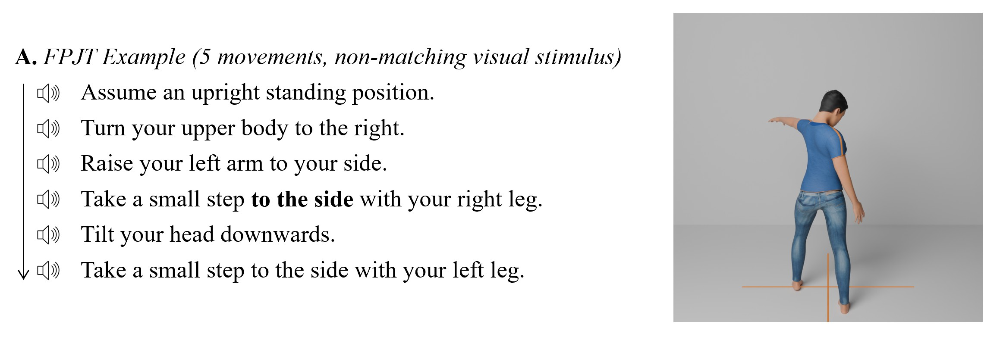

# Final Position Judgement Task (FPJT)

Available in **English**, **German**, **Spanish**, **French** (see below to implement the task in other languages).

The FPJT [(Czilczer, Martini et al., 2026)](https://doi.org/10.31234/osf.io/4sw6h_v1) is a behavioural paradigm aiming to assess the ability to imagine performing a series of auditorily instructed movements. While focusing on imagery manipulation and maintenance, it also requires generating an imagery "from scratch" and inspecting one's imagery to judge whether it matches a visual stimulus. 
If you are interested in assessing movement imagery ability, visit the [Movement Imagery Ability Platform](https://movementimageryability.github.io) for an overview of open-source behavioural tasks.

The task was adapted from earlier imagery-stimulus comparison tasks (e.g., [Madan & Singhal, 2013](https://doi.org/10.1080/00222895.2013.763764); [Nishida et al., 1986](https://doi.org/10.1123/jsep.10.4.418); [Schott, 2013](https://doi.org/10.1007/s00391-013-0520-x)). 
This repository contains the materials for the open-source (and user-friendly) FPJT, based on [(Czilczer, Martini et al., 2026)](https://doi.org/10.31234/osf.io/4sw6h_v1), provided in open-source experiment presentation software.
The most updated versions can be found in this repository.

Subsequent updates in native software ([PsychoPy](https://www.psychopy.org/index.html) and [OpenSesame](https://osdoc.cogsci.nl/)) may need adjustments. As developers, we are not responsible for implementing these in every use case.

An example of a trial is shown below. In each trial, participants listen to an audio which guides their imagery. First, participants are asked to imagine assuming the starting position. Then, they imagine performing 3 to 6 movements and judge whether their imagined final position matches the final position of a human figure, which is presented after the last instruction.

In the original experiment [(Czilczer, Martini et al., 2026)](https://doi.org/10.31234/osf.io/4sw6h_v1), one FPJT item (three movements) had atypically high error rates (> 3 SD; baseline: 63.87%; articulatory suppression: 68.07%), as the upper body rotation likely obscured detection of the incorrectly directed arm movement; and was hence excluded in data analyses. To avoid ambigiuty, the respective trial was adapted in the FPJT we provide in this GitHub repository.

## Repository information
This repository has four main folders, which contain **PsychoPy** (`.psyexp`) and **OpenSesame** (`.osexp`) experiments, together with associated files to run them **locally** (lab/desktop experiments) or **online** (in a browser).  
Please consult the accompanying manuscript ([Czilczer, Moreno-Verdú et al., 2026](https://doi.org/10.31234/osf.io/9xjfb_v1)) on the [Movement Imagery Ability Platform](https://movementimageryability.github.io/) for a guide on necessary steps to run a task in each of the four deployment modes, which can help with the decision.
- [FPJT PsychoPy local](/PsychoPy-local)
- [FPJT PsychoPy online](/PsychoPy-online)
- [FPJT OpenSesame local](/OpenSesame-local)
- [FPJT OpenSesame online](/OpenSesame-online)

The versions provided in this repository allow flexibility in terms of key experiment parameters of the FPJT:
- response mode
- trial-to-trial feedback

The optimal protocol is at the user's discretion, but sensible defaults have been implemented.

## Language expansion
If you want to contribute to this repository by providing a language translation, or want to run the task in your own language, expansions can be done relatively easily thanks to the implementation of language localisations (please read each README to understand how to implement these). You can also see these demos showing how to implement a language localisation in [PsychoPy](https://github.com/mmorenoverdu/language_localisation_demo) and [OpenSesame](https://github.com/carlacz/OpenSesame_Language-Localisation-Demo) with virtually no code.
